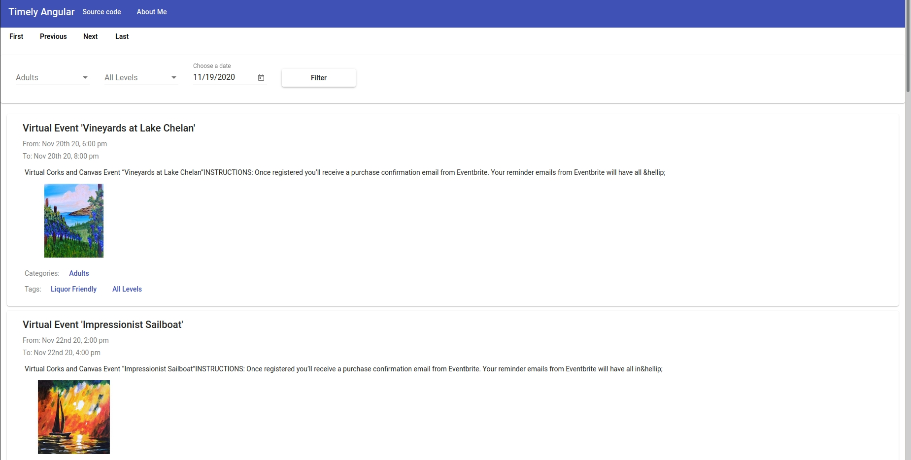
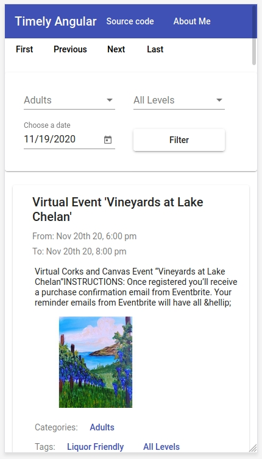
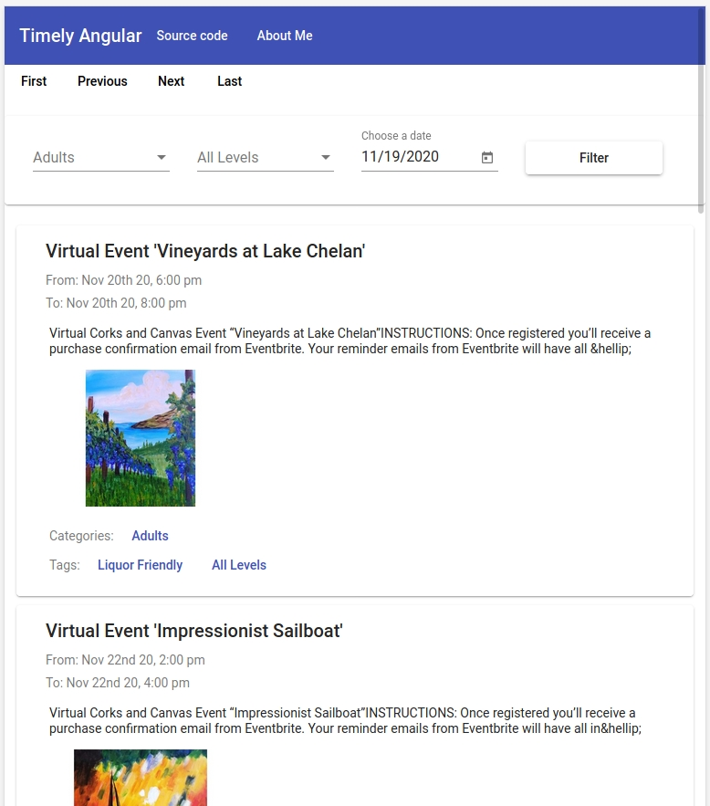

# Timely Angular Project

### Web version


### Mobile version



### Ipad version


### Live Demo
[CLICK HERE](https://timely-angular.web.app/)

## Requirements and guidelines

### a) 
#### Create a calendar based on the provided API details: 
1. Calendar should be able to list some of the events from the specified source. It can be implemented in any visual style but should display the core event's properties: title, start date, short description, an image (if presented).  
2. It should be implemented by using Angular 8 and TypeScript.  
3. Tests and comments are welcome. Code should be clean and self-explanatory.  
4. Calendar has to be responsive and look nice on different devices.  
5. Implement extra controls, such: 
- Date picker for changing the start date.  
- Add pagination option. 
- Create filter option by Taxonomies (Categories and Tags).
### b) 
#### Using API: 
1. You can get Calendar Settings by making a POST to: https://timelyapp.time.ly/api/calendars/info. Please send the following parameters along with request: url: https://calendar.time.ly/ficceyp4. In the response you'll get a JSON object of Calendar properties. You may need some of them (like "id") for further requests.  
2. Get a list of events by making a GET request to: https://timelyapp.time.ly/api/calendars/CALENDAR_ID/events, where 'CALENDAR_ID' is an 'id' you got in the previous request. Use the returned data to fill your calendar app with events. Let me know if there are any questions. 
3. Get a list of taxonomies to use in the filter option by making a GET request to: https://timelyapp.time.ly/api/calendars/CALENDAR_ID/taxonomies, where 'CALENDAR_ID' is an 'id' you got in the previous request. Use the returned data to fill your taxonomies filter bar.  
4. Query parameters to filter and paginate: 
- start_date=YYYY-MM-DD to filter date. 
- page=PAGE_NUMBER and per_page=NUM_EVENTS_PER_PAGE to paginate. 
- categories=CATEGORY_ID. 
- tags=TAG_ID.

## How to run

```
npm i
ng serve
```
Go to localhost:4200/.
